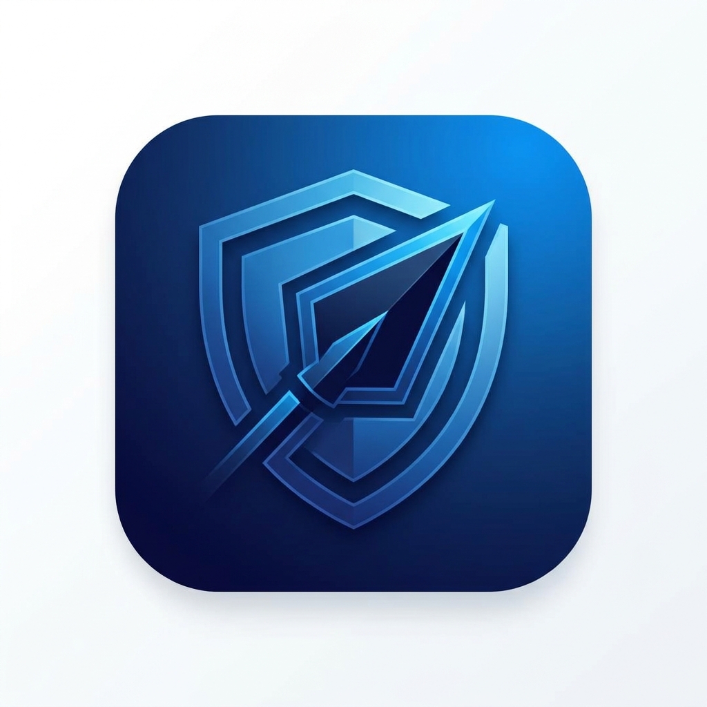

<p align="center">
  
</p>

<h1 align="center">Dark Spear</h1>

<p align="center">
  <b><i>Auditoría de seguridad autorizada, de punta a punta — con gate humano en cada paso peligroso.</i></b>
</p>

<p align="center">
  <a href="LICENSE"></a>
  
  
  
  
  
  
</p>

<p align="center">

https://github.com/user-attachments/assets/1c663f47-4240-4adf-a2bf-fd18078f3828

</p>

> **AVISO LEGAL**: Herramienta para **auditorías de seguridad autorizadas**, uso profesional y educativo. Nunca la uses contra un sistema que no sea tuyo o para el que no tengas autorización escrita explícita. El acceso no autorizado es **ilegal**. Al usar este software aceptas responsabilidad total por tus acciones. Detalle completo en [Aviso legal y ético](#aviso-legal-y-ético).

**Plataforma de auditoría de seguridad autorizada.** Un motor que recorre el pentest por fases — reconocimiento → enumeración → explotación → post-explotación, con gate humano en cada acción peligrosa — y una consola SecOps que convierte lo encontrado en un informe defendible frente al cliente.

No es un scanner automático ni un «auto-pwn». El diferencial es la disciplina de engagement: *scope-lock* en el servidor, fases que se avanzan a conciencia, cada herramienta peligrosa pasa por aprobación explícita del operador, y cada hallazgo entra al informe con evidencia y hash de integridad.

---

## Índice

- [Cómo funciona](#cómo-funciona)
- [Arquitectura](#arquitectura)
- [Qué detecta el playbook determinista](#qué-detecta-el-playbook-determinista)
- [Active Directory](#active-directory)
- [MITRE ATT&CK](#mitre-attck)
- [Arranque rápido](#arranque-rápido)
- [Qué incluye](#qué-incluye)
- [Estructura](#estructura)
- [Atribución](#atribución)
- [Aviso legal y ético](#aviso-legal-y-ético)
- [Licencia](#licencia)
- [Mantenedor](#mantenedor)

---

##  Cómo funciona

El motor ofrece dos modos, seleccionables por engagement:

- **Playbook determinista** — sin LLM, sin coste de tokens, 100 % reproducible. Recorre las 4 fases PTES y ejecuta un catálogo curado de sondas (OWASP Top 10, JWT, IDOR, credenciales por defecto, exposición de código, superficie cloud y OSINT). Los hallazgos se generan por heurística contra la evidencia *de esa sonda*, nunca contra el blob acumulado de la fase: así se evitan falsos positivos por señal cruzada entre pasos.
- **Agente ReAct con LLM** — el loop corre en el navegador (`js/agent.js` + `js/ollama.js`) contra un pool de API keys de Ollama Cloud (cifrado, con rotación automática por cuota agotada) y decide el siguiente comando. Útil para explorar fuera del catálogo fijo. En ambos modos el servidor no confía en el cliente: el *enforcement* de alcance y de herramientas peligrosas vive en `bridge.py`.

> **Estado de cada modo:** el playbook determinista es el camino validado en engagements reales — es el modo por defecto si no configuras un modelo/API key (sin key seleccionada, el motor cae automáticamente a playbook, no falla). El agente ReAct con LLM es **experimental**: no probado a fondo en producción, requiere tus propias Ollama Cloud API keys. Úsalo con esa expectativa.

Cada hallazgo —propuesto por el playbook o por el LLM— pasa por revisión del operador antes de entrar al informe. Al aceptarlo, la evidencia se hashea a disco (cadena de custodia real, no un volcado del chat) y se enriquece con CVSS v3.1, CWE, OWASP, ISO 27001, ENS, NIS2, RGPD y MITRE ATT&CK.

##  Arquitectura

Tres piezas que se integran en un solo producto, no proyectos separados:

| | |
|---|---|
| **`backend/js/`** — el motor | `playbook.js` orquesta las 4 fases PTES y las sondas (`curl`, `nmap`, `whatweb`, `gobuster`, `hydra`, `katana`, `wapiti`, `arjun`, `dalfox`). `vuln-kb.js` es el catálogo de payloads: inyección SQL/NoSQL, XSS reflejado, open redirect, IDOR, JWT (crackeo offline HS256 y bypass `alg=none`), secretos en bundles JS, fingerprint de WAF/CDN y de proveedor cloud, SSRF hacia metadata AWS, bucket S3 público, OSINT vía Wayback Machine, más los parsers de wapiti/arjun/dalfox (scan activo, descubrimiento de parámetros y confirmación de XSS encadenados). `finding-heuristics.js` evalúa cada sonda contra su propio paso. Todo corre en el navegador y habla con `bridge.py` solo para ejecutar el binario permitido. |
| **`backend/`** — el servidor | `bridge.py` (stdlib + `cryptography`) es el único punto de confianza: whitelist de herramientas, *scope-lock*, gate de 4 fases PTES, keystore cifrado del pool de Ollama Cloud, persistencia de hallazgos con evidencia hasheada. Arranca también el panel embebido en un hilo: un proceso, un puerto que abrir. |
| **`panel/`** — la consola | 30 pantallas: dashboard, engagement activo, aprobación de herramientas, hallazgos críticos, Attack Graph, MITRE ATT&CK (36 técnicas con detección propia, mapeadas por hallazgo real), OSINT, gobernanza (RGPD, matriz de madurez/riesgo, plan de remediación, Kill Chain) y reporting (JSON/HTML, informe integral con ficha por hallazgo). `panel/vendor/engine/js/` es una copia sincronizada de `backend/js/` vía `scripts/sync-engine-js.py`, para ejecutar el mismo motor sin bundler. |

El historial de diseño técnico del motor (spec + plan de implementación por pieza, con revisión de código en cada paso) vive en `backend/docs/superpowers/`.

##  Qué detecta el playbook determinista

<details>
<summary><b>Ver catálogo completo</b> — inyección, auth, JWT, APIs, recon, exposición de código, cloud, smuggling, firewalls, OSINT</summary>

Sin escribir un prompt ni gastar un token, contra cualquier stack (PHP clásico, Node/Express, SPA/REST, APIs JSON):

- **Inyección** — SQLi y NoSQLi en login (operadores Mongo `$gt`), XSS reflejado con marcador único, SSTI genérico (un solo payload cubre Jinja2/Twig/Freemarker/ERB/Razor/Pug, confirma solo si el motor EVALUÓ la expresión), XXE (entidad externa contra rutas típicas XML/SOAP, confirma solo con lectura real de `/etc/passwd`), open redirect, IDOR genérico contra recursos REST por ID numérico. `wapiti` corre como scanner activo (XSS/SQLi/CSRF/exec/traversal/upload/redirect/backup); `arjun` descubre parámetros GET ocultos no visibles en el HTML/JS ya crawleado y los encadena a `sqlmap`/`dalfox`, que confirman SQLi/XSS real sobre esos parámetros — no adivinados. `nuclei` corre con tags curados (`exposure,misconfig,default-login,cve`) — el tag `cve` suma miles de plantillas de CVEs conocidas, cada una con matcher propio (no aumenta falsos positivos).
- **Autenticación y sesión** — credenciales por defecto vía `hydra` (diccionarios curados 17×25, corta al primer hit), cookies sin `Secure`/`HttpOnly`/`SameSite`, cabeceras de seguridad ausentes (HSTS, `X-Content-Type-Options`, anti-clickjacking, CSP).
- **JWT** — crackeo offline de secretos HS256 débiles (SHA-256/HMAC-SHA256 en JS puro, diccionario curado, sin red) y bypass `alg=none` reforjando el token capturado contra endpoints protegidos.
- **APIs** — introspección GraphQL expuesta (descubrimiento de endpoint + query `__schema`), CORS mal configurado (wildcard + credentials, reflejo de `Origin` no confiable).
- **Reconocimiento activo** — sigue de verdad los hallazgos de `gobuster`/`ffuf` (no una lista fija de adivinanzas) y las rutas `Disallow` de `robots.txt`; huella de tecnología (`whatweb`), método `TRACE` habilitado, subdomain takeover (CNAME colgante vía `httpx -cname` contra fingerprints de proveedores conocidos). Crawling activo con `katana` (links + parseo de JS) inventaría endpoints que un SPA solo genera al renderizar. Nikto/gobuster/ffuf/katana/wapiti/arjun se omiten solo en DVWA (ya cubierto por sondas de módulo); contra el resto de objetivos, incluida una IP de laboratorio, sí se ejecutan.
- **Login web genérico** — detecta CSRF (7 nombres de campo: `_token`, `user_token`, `csrf_token`, `csrfmiddlewaretoken`, `authenticity_token`, `_csrf`, `__RequestVerificationToken`), campo de usuario/contraseña/submit reales del form y arma el POST correspondiente. Sin `<form>` de password (SPA tipo Juice Shop), cae a un POST JSON directo contra `/rest/user/login` si la firma del stack lo indica.
- **Exposición de código y config** — `.git`/`.env`/backups accesibles, phpMyAdmin, Swagger/OpenAPI y Actuator sin proteger, source maps y métricas Prometheus, secretos (claves AWS/Google/Stripe/Slack/GitHub, claves privadas) hardcodeados en bundles JS ya servidos.
- **Superficie cloud** — fingerprint pasivo de WAF/CDN e infraestructura por cabeceras; SSRF genérico hacia el Instance Metadata Service de AWS/GCP/Azure (`169.254.169.254`) con detección de credenciales/tokens filtrados; bucket S3, contenedor Azure Blob o bucket GCS público referenciado por la app; `cloud_enum` permuta nombre de la organización contra los tres proveedores para encontrar storage no enlazado desde la app.
- **HTTP Request Smuggling** (Fase 3, gate humano de avance de fase) — sondas de timing CL.TE/TE.CL por conexión TCP cruda (curl no puede mandar `Content-Length`/`Transfer-Encoding` ambiguos de forma fiable). Solo candidato de timing: requiere confirmación manual con respuesta diferencial antes de darlo por explotado.
- **Cortafuegos (caja negra)** — nmap de perímetro: puertos de gestión/BD *open* vs *filtered*, servicios que no deberían estar en 0.0.0.0/0 (SSH, RDP, SMB, MySQL, Redis, Mongo…), WAF que bloquea una sonda inofensiva, o ausencia de WAF observable en un dominio público. Cada hallazgo de puerto abierto incluye la regla ufw/iptables/Security Group para cerrarlo.
- **Cortafuegos (caja gris)** — solo si el objetivo es el propio host (`127.0.0.1` / localhost): lectura de `ufw status`, `iptables -L` y `nft list ruleset`. Ahí sí se auditan las reglas activas del sistema. Contra un target remoto esos pasos no corren: serían el firewall de Kali, no el del cliente.
- **OSINT** — DNS (A/AAAA/MX/NS/TXT), RDAP/WHOIS, Certificate Transparency (crt.sh), subdominios comunes, y rutas históricas indexadas en Wayback Machine.

Cada hallazgo llega con ficha propia: CVSS v3.1 (vector completo), CWE, OWASP Top 10, técnica(s) MITRE ATT&CK, ISO 27001/ENS/NIS2/RGPD y narrativa + pasos de remediación en ES/EN. No hay CVSS ni MITRE «por severidad»: cada tipo tiene su catálogo.

</details>

##  Active Directory

<details>
<summary><b>Ver cobertura AD completa</b> — enumeración, Kerberos, ADCS, delegación, BloodHound, firewall</summary>

Contra un dominio en alcance, con o sin credenciales:

- **Enumeración** (Fase 1/2) — SMB/LDAP/RPC nulo y autenticado (`netexec`, `enum4linux`, `rpcclient`, `ldapsearch`), usuarios/grupos/política de contraseñas, GPP cpassword y autologon en SYSVOL (clave AES pública de MS14-025), LAPS legible por la cuenta de auditoría, trusts de dominio.
- **Kerberos** — AS-REP Roasting (`GetNPUsers.py`, cuentas sin preauth) y Kerberoasting (`GetUserSPNs.py`, SPNs con TGS crackeable offline).
- **ADCS** — plantillas de certificado vulnerables vía `certipy find` (ESC1/ESC8 y el resto de la matriz conocida).
- **Delegación** — inventario de delegación unconstrained/constrained/RBCD (`findDelegation.py`) y explotación asistida (`getST.py`, `ticketer.py`).
- **BloodHound** — `bloodhound-python -c DCOnly` recolecta el grafo completo; dark_spear parsea las aristas de ACL peligrosas directamente a findings (sin abrir la UI): `GenericAll`/`GenericWrite`/`WriteDacl`/`WriteOwner`/`Owns`/`AddMember`/`AddSelf`/`ForceChangePassword`/`AllExtendedRights`/`WriteSPN`, **Shadow Credentials** (`AddKeyCredentialLink` — autenticar como el objetivo vía PKINIT sin tocar su contraseña) y **DCSync** (solo si el mismo principal tiene `GetChanges` **y** `GetChangesAll` sobre el dominio).
- **Cortafuegos AD** (Fase 3, gate humano) — estado de Windows Defender Firewall en el DC vía `netexec -x netsh advfirewall show allprofiles` (no hay vía de solo lectura por RPC/LDAP).

</details>

##  MITRE ATT&CK

El panel de Attack Graph / MITRE mapea cada hallazgo a su técnica real (regex contra título y descripción, no una tabla estática) y muestra la cobertura efectiva sobre las 13 tácticas de Enterprise ATT&CK relevantes para una auditoría web no destructiva: **36 técnicas con detección propia**, desde `T1190` (Exploit Public-Facing Application) y `T1110` (Brute Force) hasta técnicas cloud como `T1552.005` (Cloud Instance Metadata API) y `T1530` (Data from Cloud Storage). Las tácticas de post-explotación destructiva (Impact, gran parte de Lateral Movement/Exfiltration) quedan deliberadamente fuera de alcance: es una auditoría autorizada, no un ejercicio de Red Team con daño real.

##  Arranque rápido

Pensado para **Kali/Linux** (herramientas de pentest en el PATH). Requiere Python 3.10+ y el paquete `cryptography`.

En Kali, `pip install` a nivel sistema falla (`externally-managed-environment`). Usa apt o un venv:

```bash
# Opción A — paquete de Kali (la más simple)
sudo apt install -y python3-cryptography

# Opción B — venv
cd ~/dark_spear/backend
python3 -m venv .venv
source .venv/bin/activate
pip install -r requirements.txt
```

### Un solo comando (recomendado)

`bridge.py` arranca el motor **y** embebe el panel en el mismo proceso — un puerto, un Ctrl+C:

```bash
./scripts/start-dark-spear.sh
# equivalente: cd backend && python3 bridge.py
```

Pide una passphrase (cifra el pool de API keys) e imprime:

```
Motor:  http://127.0.0.1:8420/
Abre el panel (no uses file://):
  http://127.0.0.1:8080/start-engagement.html
```

Abre esa URL del panel tal cual. No hace falta pegar ningún token: el panel lo descubre desde un archivo de sesión local (0600, solo lectura para tu usuario) y lo reenvía al motor por cabecera `X-Auditor-Token` en cada request.

Si ya corriste el motor y no recuerdas la passphrase:

```bash
rm ~/.auditor/keys.enc
python3 backend/bridge.py
```

### Panel y motor por separado (opcional)

Para desarrollo del frontend sin tocar el motor, `AUDITOR_NO_PANEL=1 python3 bridge.py` omite el panel embebido:

```bash
cd panel && python3 server.py     # http://127.0.0.1:8080/ — no abrir como file://
```

### Sincronizar el motor hacia el panel

Tras editar cualquier archivo en `backend/js/`:

```bash
python3 scripts/sync-engine-js.py
```

### Verificar el playbook contra laboratorios

Con Juice Shop y/o DVWA en local:

```bash
node scripts/test-playbook-juiceshop-phase1.mjs http://127.0.0.1:3000
node scripts/test-playbook-dvwa.mjs http://127.0.0.1:8888
```

Los scripts reevalúan heurísticas tras cada sonda (igual que el motor en producción) y fallan si aparecen falsos positivos de directorio o si faltan hallazgos esperados.

##  Qué incluye

- Dashboard, escaneos activos, vulnerabilidades y hallazgos críticos
- Engagement activo, New Scan, aprobación de herramientas peligrosas
- Playbook determinista (60+ sondas, sin LLM) + agente ReAct con LLM, seleccionables por engagement
- Reporting (JSON / HTML) e informe integral con portada de organización/auditor (Ajustes → Perfil), una ficha por hallazgo con evidencia en estilo terminal, KPIs por severidad, causa raíz y controles observados
- Gobernanza: alineación RGPD, matriz de madurez/riesgo, plan de remediación, Kill Chain
- Attack Graph, evidencia de grafo, MITRE ATT&CK (36 técnicas mapeadas a hallazgos reales), OSINT (DNS, WHOIS, crt.sh, Wayback Machine), activos
- Perfil de usuario, centro de notificaciones, ajustes (tema e idioma)
- Motor: *scope-lock*, gate de 4 fases PTES, pool de API keys con rotación, hallazgos con evidencia hasheada a disco, catálogo propio de CVSS/CWE/MITRE por tipo de hallazgo

Tema claro/oscuro e idioma ES/EN se guardan en el navegador (`ds-theme`, `ds-lang`). El menú lateral se retrae a un rail de iconos (`ds-sidebar`).

##  Estructura

```
dark_spear/
│
├── 🖥️  panel/                    Consola SecOps — 30 páginas HTML estáticas
│   └── vendor/                   Assets propios
│       ├── tokens.css              Design tokens (tema claro/oscuro)
│       ├── i18n.js                 Textos ES/EN
│       ├── panel-live.js           Lógica de la consola
│       ├── finding-dossier.js      Ficha de hallazgo
│       └── engine/js/              ⟲ copia sincronizada de backend/js/
│                                    (scripts/sync-engine-js.py)
│
├── ⚙️  backend/                  Motor Auditor
│   ├── bridge.py                 Servidor — único punto de confianza:
│   │                              scope-lock · fases PTES · exec de
│   │                              herramientas · keystore · findings ·
│   │                              panel embebido
│   ├── keystore.py               Cifrado Fernet/PBKDF2 del pool de API keys
│   ├── js/                       Motor (corre en el navegador)
│   │   ├── playbook.js             Fases PTES + orquestación (~60 sondas)
│   │   ├── vuln-kb.js               Catálogo de payloads/probes/heurísticas
│   │   ├── finding-heuristics.js    Evalúa cada sonda contra su propio paso
│   │   ├── agent.js                 Loop: playbook determinista ↔ ReAct+LLM
│   │   └── ollama.js, bridge_client.js, db.js, ui.js, axis.js, main.js
│   ├── index.html, style.css     UI del motor
│   └── docs/superpowers/         Specs + planes de implementación
│
├── 📜 scripts/                   start-dark-spear.sh · sync-engine-js.py
│                                  test-playbook-*.mjs
│
└── 📄 LICENSE                    MIT
```

##  Atribución

- Iconografía de la consola y de este README: [Lucide](https://lucide.dev) (ISC License).
- Resto de UI, motor y diseño de producto: propios de este proyecto.

##  Aviso legal y ético

Herramienta de uso profesional para auditorías de seguridad **autorizadas**.

- Úsala solo en sistemas propios, laboratorios controlados, o engagements con autorización escrita explícita del cliente.
- El *scope-lock* y los gates de confirmación del motor son deliberados: no los desactives para saltarte el alcance acordado.
- El autor no se hace responsable del uso indebido de este software fuera del alcance autorizado.

##  Licencia

Distribuido bajo licencia [MIT](LICENSE) · Copyright © 2026 Yoandy Ramírez Delgado.

##  Mantenedor

<table>
<tr>
<td align="center" valign="top">
<br/>
<b>Yoandy Ramírez Delgado</b>: Creador y Mantenedor<br/>
<sub>Junior Pentester · eJPTv2 · Offensive Security · AI Governance (ISO 42001) · SysAdmin</sub><br/><br/>
<small>Pentester en formación continua, enfocado en explotación web y Active Directory. Construye Dark Spear como plataforma propia de auditoría — el motor, el catálogo de sondas y la disciplina de engagement nacen de la práctica en HackTheBox y auditorías reales, no de una demo.</small><br/><br/>
<a href="https://www.linkedin.com/in/yoandyrd92/">LinkedIn</a> · <a href="https://github.com/heindall92">GitHub</a> · <a href="https://yoandyramirez.com">Portafolio</a> · <a href="https://profile.hackthebox.com/profile/019c5812-b4ca-7315-b12f-14db6d2b42fa">HackTheBox</a>
</td>
</tr>
</table>
